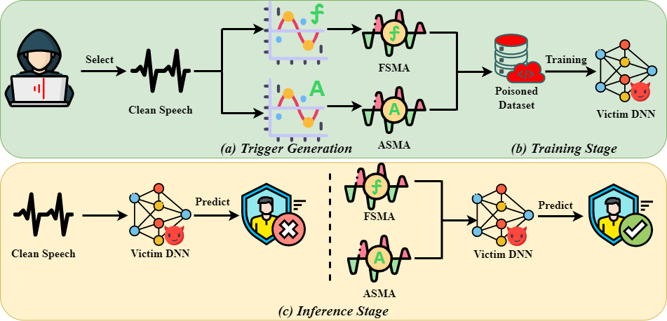

# README
This is the official implementation of our paper "Modulation-Based Backdoors: Leveraging Amplitude and Frequency Patterns to Attack Speaker Recognition". This research project is developed based on Python 3 and Pytorch.


## The Main Pipeline of Our Methods



## Requirements

To install requirements:

```python
pip install -r requirements.txt
```

## Usage


### Generate Benign Dataset
Our training process first involves extracting audio features and saving these features as .npy format files, followed by training on these .npy files. Therefore, our initial step is to perform feature extraction to generate featureized training and testing sets.

```
$ python benign_feature_extract.py
```

### Train Benign Model

```
$ python benign_model_train.py
```

### Generate Poison Dataset

Generating a poisoned dataset involves the following steps: First, embed triggers into a subset of audio files to create a dataset in .wav format containing poisoned audios. Next, perform feature extraction on this dataset and save the extracted features as .npy format files. Finally, use these .npy format datasets to train the backdoor model.

```
$ python trigger_embed.py   // trigger embedding
```


```
$ python poison_feature_extract.py   // Feature extraction
```


```
$ python backdoor_model_train.py   // Train Backdoor model
```


```
$ python attack_test.py   // Attack test
```

## License 

This project is licensed under the terms of the Apache License 2.0. See the LICENSE file for the full text.